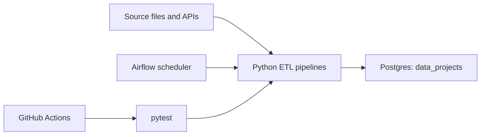

# Data Engineering Portfolio

Eight data engineering projects covering batch ingestion, API ingestion, data quality, JSON normalization, dimensional modeling, analytics marts, log processing, Azure Data Factory orchestration, testing, CI/CD, and containerized local infrastructure.

The repository runs with local Airflow and Postgres through Docker Compose. No cloud resources are provisioned by default.

## Overview

- End-to-end ETL and ELT pipelines with clear inputs, transformations, and outputs.
- Airflow DAGs for scheduling, retries, and pipeline run tracking.
- Postgres-backed loading for relational and analytics-ready tables.
- Tests with `pytest` and a root CI command for repeatable validation.
- Environment-based configuration with no hard-coded secrets.
- Docker Compose infrastructure for local development.
- GitHub Actions workflow for continuous integration.

## Projects

| # | Project | Purpose | Engineering Focus |
| --- | --- | --- | --- |
| 1 | [Batch Sales ETL Platform](project_1_csv_pipeline/) | Load sales CSV data into a queryable database table. | pandas ETL, validation, Postgres loading, Airflow scheduling |
| 2 | [Resilient API Ingestion Pipeline](project_2_api_pipeline/) | Ingest external weather API data safely and repeatedly. | API extraction, timeouts, HTTP errors, mocked tests, retries |
| 3 | [Data Cleaning and Quality Pipeline](project_3_data_cleaning/) | Separate usable records from invalid records before downstream processing. | validation rules, rejected-record handling, quality checks |
| 4 | [Nested JSON Order Normalization](project_4_json_pipeline/) | Convert nested order payloads into relational tables. | JSON parsing, normalization, referential checks |
| 5 | [Dimensional Data Warehouse](project_5_data_warehouse/) | Model sales data for analytics and reporting. | star schema, dimensions, fact tables, SQL DDL |
| 6 | [E-commerce Analytics Pipeline](project_6_ecommerce_pipeline/) | Build customer, product, and revenue analytics from multiple sources. | joins, KPI marts, customer metrics, gold-layer outputs |
| 7 | [Log Analytics and Performance Pipeline](project_7_log_pipeline/) | Parse application logs and maintain incremental analytics. | regex parsing, high-watermark state, operational marts |
| 8 | [Azure Data Factory Blob Pipeline](project_8_azure_pipeline/) | Copy and map a customer churn CSV through Azure Blob Storage with ADF artifacts preserved after teardown. | Azure Data Factory, Blob Storage, linked services, dataset schemas, cost-safe proof |

## Documentation

- [Project Index](docs/PROJECT_INDEX.md)
- [Local Platform Guide](docs/LOCAL_PLATFORM.md)

## Local Architecture



## Quick Start

Create a virtual environment and install dependencies:

```bash
python -m venv .venv
source .venv/bin/activate
pip install -r requirements.txt
cp .env.example .env
```

Run the validation suite:

```bash
make ci
```

Start the local platform:

```bash
make up
```

Open Airflow:

- URL: `http://localhost:8081`
- Username: `admin`
- Password: `admin`

Postgres is available from the host on `localhost:5433`.

Stop the platform:

```bash
make down
```

## Verification

Current local verification:

- `26 passed`
- Docker Compose config validated.
- Postgres runs locally on `localhost:5433`.
- Airflow runs locally on `http://localhost:8081`.
- Airflow discovers all seven local project DAGs with no import errors.
- `portfolio_sales_batch_etl` has passed an Airflow DAG test.

Useful commands:

```bash
make test
make dry-run-all
make ci
make status
make airflow-logs
make postgres-shell
```

## Repository Layout

```text
.
|-- dags/                         # Root Airflow DAG wrappers
|-- docs/                         # Project and platform documentation
|-- infra/postgres/init/          # Local Postgres initialization
|-- project_1_csv_pipeline/       # Batch sales ETL
|-- project_2_api_pipeline/       # API ingestion
|-- project_3_data_cleaning/      # Data quality pipeline
|-- project_4_json_pipeline/      # JSON normalization
|-- project_5_data_warehouse/     # Star schema warehouse
|-- project_6_ecommerce_pipeline/ # E-commerce analytics
|-- project_7_log_pipeline/       # Log analytics
|-- project_8_azure_pipeline/     # Azure Data Factory Blob pipeline
|-- docker-compose.yml            # Local Airflow + Postgres platform
|-- Makefile                      # Common developer commands
|-- requirements.txt              # Shared Python dependencies
`-- .github/workflows/ci.yml      # CI pipeline
```

## Cloud Resources

This repository is configured for local development and does not create cloud infrastructure. The Azure project stores sanitized ADF artifacts and sample data only; live Azure resources are not required after capture.
