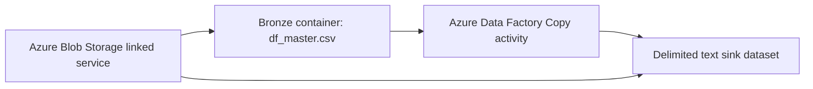

# Azure Data Factory Blob Pipeline

This project documents a small Azure Data Factory pipeline that copies a customer churn CSV dataset through Azure Blob Storage using ADF datasets, a Blob Storage linked service and explicit column mapping.

The Azure resources used for the live run are not required after capture. The repository keeps a sanitized export of the ADF objects so the work remains reviewable after cost-safe teardown.

## Architecture



## What Is Included

- `adf/pipeline/projectpipeline1.json` - sanitized ADF pipeline export.
- `adf/dataset/DelimitedText1.json` - source delimited-text dataset schema.
- `adf/dataset/DelimitedText2.json` - sink delimited-text dataset schema.
- `adf/linkedService/AzureBlobStorage1.json` - public-safe linked service structure with secrets removed.
- `metadata/download_info_public.txt` - non-sensitive export metadata.
- `data/sample_telco_churn.csv` - tiny sample file matching the dataset schema.
- `scripts/validate_adf_export.py` - local validation for references, mappings and secret hygiene.

## Pipeline Flow

1. Read `df_master.csv` from an Azure Blob Storage `bronze` container.
2. Use an ADF Copy activity with delimited-text read settings.
3. Apply a tabular translator for the Telco churn fields.
4. Write the mapped output through a delimited-text sink.

## Engineering Evidence

- Cloud orchestration with Azure Data Factory.
- Blob Storage linked service configuration.
- Source and sink dataset definitions.
- Explicit schema mapping for customer churn fields.
- Public-safe teardown approach: live resources removed, sanitized deployment evidence retained.
- Local validation that does not require active Azure billing.

## Run Local Validation

```bash
python project_8_azure_pipeline/scripts/validate_adf_export.py
```

Expected output:

```text
ADF export validation passed.
```

## Cost Control

The live Azure resource group should be deleted after capturing screenshots and exports. This project is designed so reviewers can inspect the ADF artifacts without requiring the Azure services to remain active.
